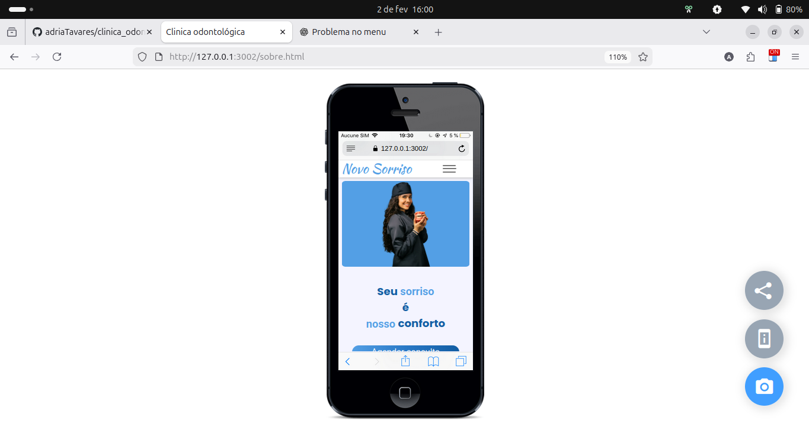

# 🦷 Clínica Odontológica – Novo Sorriso

Projeto de site institucional responsivo para uma clínica odontológica fictícia,
desenvolvido com foco em organização de código, experiência do usuário (UX) e boas
práticas de front-end.

## 📸 Preview

### Mobile


### Tablet


### Desktop


## 🚀 Funcionalidades

- Menu de navegação com destaque automático conforme a seção visível
- Layout totalmente responsivo (mobile, tablet e desktop)
- Menu mobile com abertura e fechamento animados
- Slider de depoimentos
- Animações de entrada utilizando IntersectionObserver
- Integração com links de contato (WhatsApp e redes sociais)

## 🛠️ Tecnologias Utilizadas

- HTML5 semântico
- CSS3 (separado por dispositivos)
- JavaScript (ES6+)
- IntersectionObserver API
- Git & GitHub

## 📁 Organização do Projeto

```text
├── css
│   ├── estilos_universais
│   ├── css_mobile
│   ├── css_tablet
│   └── css_desktop
├── js
│   ├── menu
│   ├── slide
│   ├── efeitos
│   └── formatacao_index
├── imagens_markdown
|   |── desktop.png
    ├── tablet.png
    ├── mobile.png
├── images
└── index.html
```
